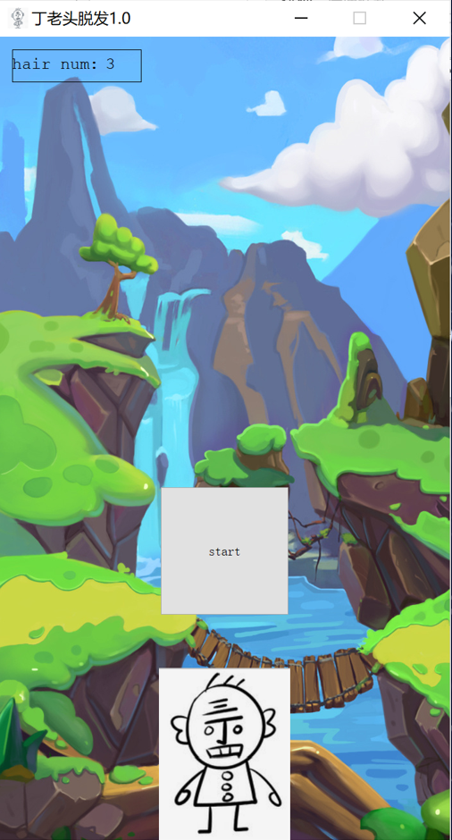

# Old-Ding-Adventures
- 项目介绍：使用QT完成飞机大战改良版小游戏制作——《丁老头历险记》
- 编程语言：C++
- 完成时间：2022.5.2-5.8

## 页面展示

## 在B站已发布项目讲解视频
https://www.bilibili.com/video/BV1PU4y1m7r1/

#### 一些碎碎念：非常简易且丑陋的一个作业，放在这里只是想怀念大一的美好青春罢了（狗头
